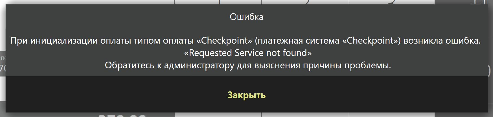

# Checkpoint plugin for iiko

Для подключения плагина необходимо:
1. Cкопировать папку с плагином в директорию 'iiko\iikoRMS\Front.Net\Plugins\'
2. Запустить iikoFront
3. Запустить iikoOffice и настроить в секии "Розничные продажи" типы оплат: добавить внешний тип оплат, 
в выпадающем списке "Безналичный тип" должна появиться опция Checkpoint.
Для принятия оплаты в IIKO необходимо настроить виртуальный фискал. Затем во фронте не забыть открыть кассовую смену.
   
Спустя 5-10 минут работы IIKO Front при попытке оплатить спсобом Checkpoint получаем ошибку:
